<div align="center">

# 10:1024 Decoder from RTL to GDSII 
### A Silicon Journey: Solving High Fanout from RTL to GDSII

[](https://github.com/The-OpenROAD-Project/OpenLane)
[](https://github.com/google/skywater-pdk)
[](#)
[](#)

*Tackling massive High Fanout Nets (HFN), pad-limited floorplanning, and architectural hierarchies using open-source VLSI tools.*

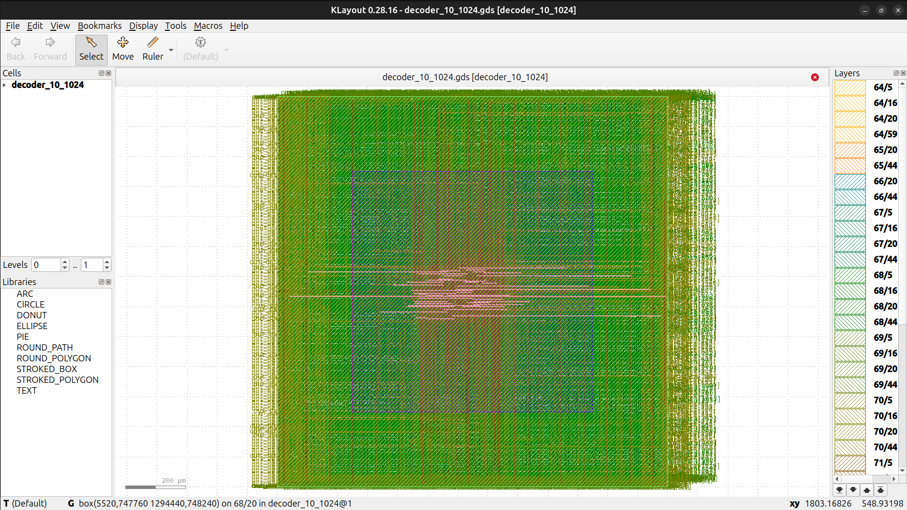

---

**[Explore the Visual Journey](#-the-rtl-to-gdsii-visual-journey) • [Reproduce the Flow](#-how-to-reproduce) • [Repository Structure](#-repository-structure)**

</div>

---

## 💡 The Physical Design Challenge
While an encoder suffers from a routing bottleneck, a massive 10-to-1024 Decoder faces the exact opposite physics problem: an **explosion of wires**.

> ⚠️ **The High Fanout Net (HFN) Problem**
> We have just 10 input wires that must traverse the entire silicon die to drive 1024 separate output pins. Without intervention, standard logic cells cannot supply enough current to charge the massive parasitic capacitance of these long wires, leading to catastrophic slew and setup violations. Furthermore, squeezing 1,035 I/O pins along the edge creates a severe "Pad-Limited" scenario.

**How did we solve it?**
1. **Architectural Pre-Decoding:** Instead of a flat 10:1024 design, the RTL implements a 2-to-4 pre-decoder that intelligently enables one of four localized `8:256` logic islands.
2. **Die Area Expansion:** Expanding the footprint to `1300µm x 1300µm` to give the 1,035 physical I/O pins enough perimeter space to pass Sky130 metal spacing DRCs.
3. **Aggressive Buffer Insertion:** Forcing OpenROAD's `PL_RESIZER` and `GLB_RESIZER` to aggressively drop buffer trees deep into the routing channels to maintain signal integrity across the massive fanout nets.

---

## 🛠️ Tools & Technology Stack

| Stage | Open-Source Tool |
| :--- | :--- |
| **Process Node** | SkyWater 130nm (`sky130A`) |
| **Simulation** | Icarus Verilog (`iverilog`) & GTKWave |
| **Logic Synthesis** | Yosys & abc |
| **Floorplan & Placement** | OpenROAD |
| **Routing** | FastRoute (Global) & TritonRoute (Detailed) |
| **Timing Signoff (STA)** | OpenSTA |
| **Physical Signoff (DRC/LVS)**| Magic & Netgen |

---

## 📖 The RTL-to-GDSII Visual Journey

Follow the automated pipeline execution step-by-step!

### 1️⃣ RTL Design & Functional Verification
The hierarchical design was put through an exhaustive testbench, sweeping all 1,024 addresses and aggressively toggling the enable pin to verify 100% accurate address decoding.

<p align="center">
  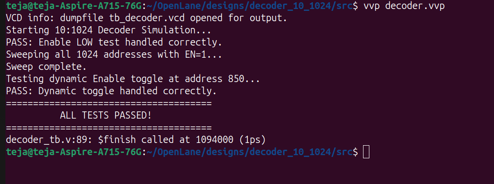
  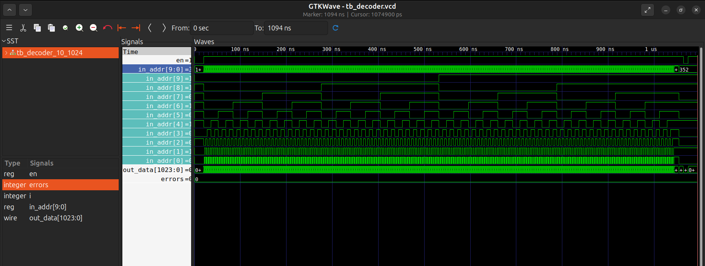
</p>

### 2️⃣ Logic Synthesis (Yosys)
The Verilog code is mapped to standard cells from the Sky130 library. The synthesizer was configured with `SYNTH_STRATEGY: DELAY 1` to prioritize strong, high-drive standard cells to combat the fanout load.

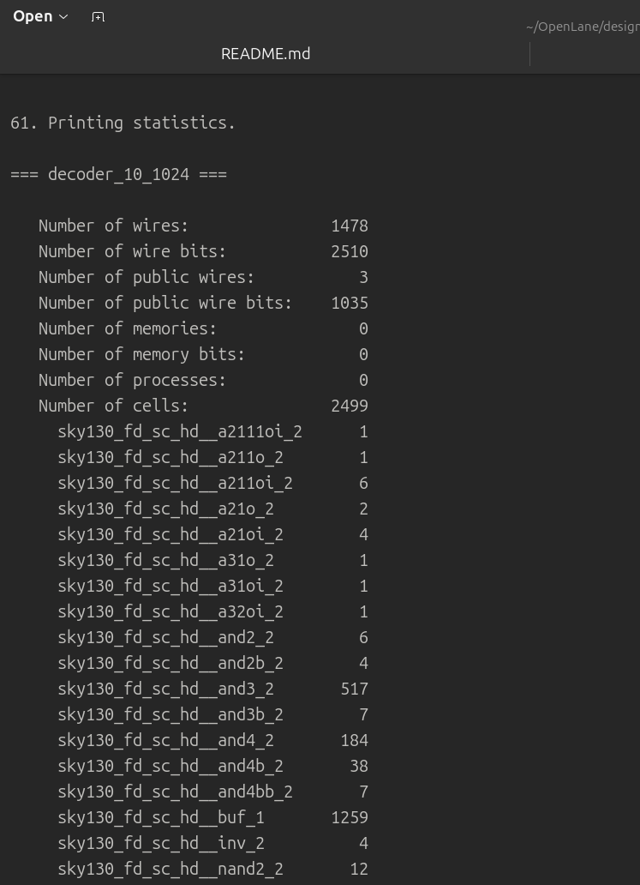

### 3️⃣ Floorplanning & PDN Generation
We set an absolute die area of `1300µm x 1300µm`. Following the placement of 1,035 I/O pins, the Power Delivery Network (PDN) was generated, creating a robust metal grid of `VDD` and `GND` stripes to power the core evenly.

> 💡 **Pro-Tip for Interactive Viewing:** > Want to explore the layout in 3D? Open the `.odb` files inside the OpenLane docker container using `openroad -gui` and run `read_db <filename>.odb`!

<p align="center">
  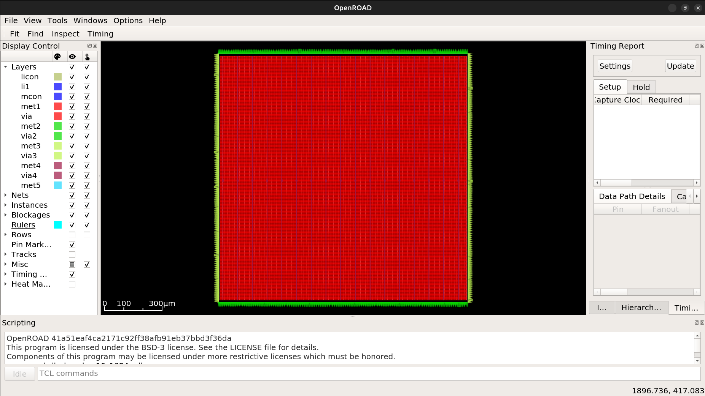
  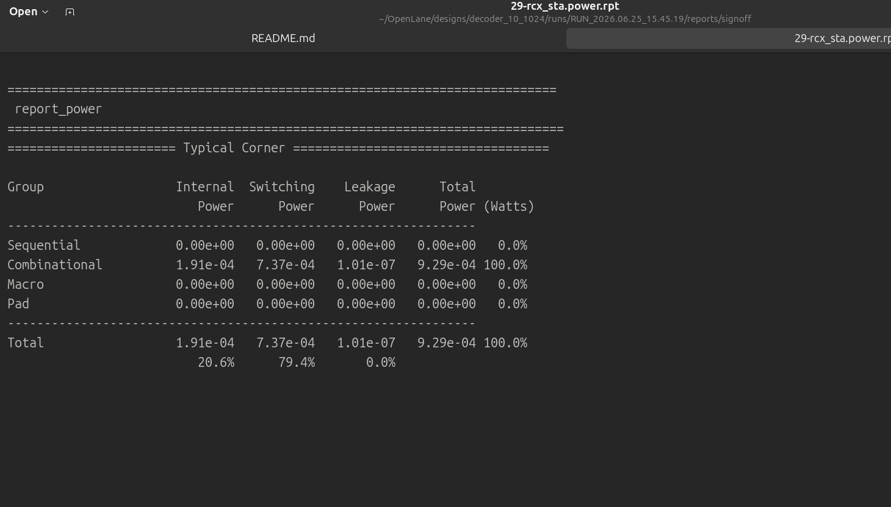
</p>

### 4️⃣ Global & Detailed Placement
OpenROAD assigns physical locations to the synthesized standard cells. The target density was kept exceptionally low (`40%`) to leave vast swaths of empty silicon purely for routing channels and dynamically inserted buffer trees.

<p align="center">
  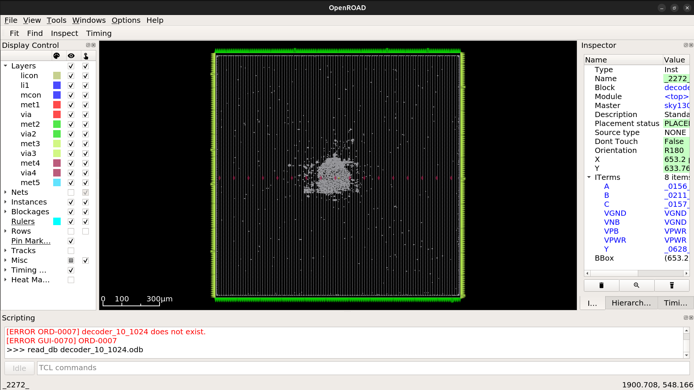
  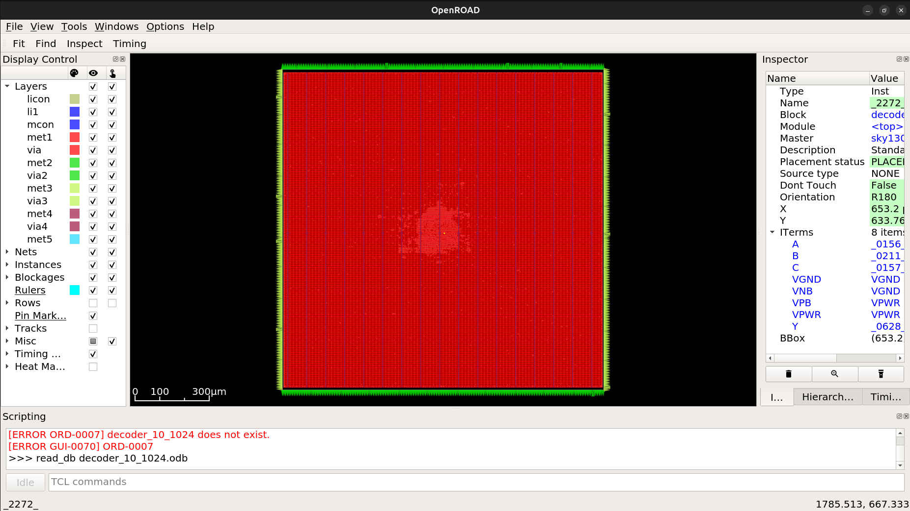
</p>

### 5️⃣ Routing & Timing Closure
Routing 10 inputs to 1,024 outputs across a 1.3mm die introduces massive Resistance-Capacitance (RC) delays. By forcing physical resizers during placement and routing, OpenROAD successfully maintained signal integrity. **Result:** Clean timing with 0 Setup and 0 Slew Violations.

<p align="center">
  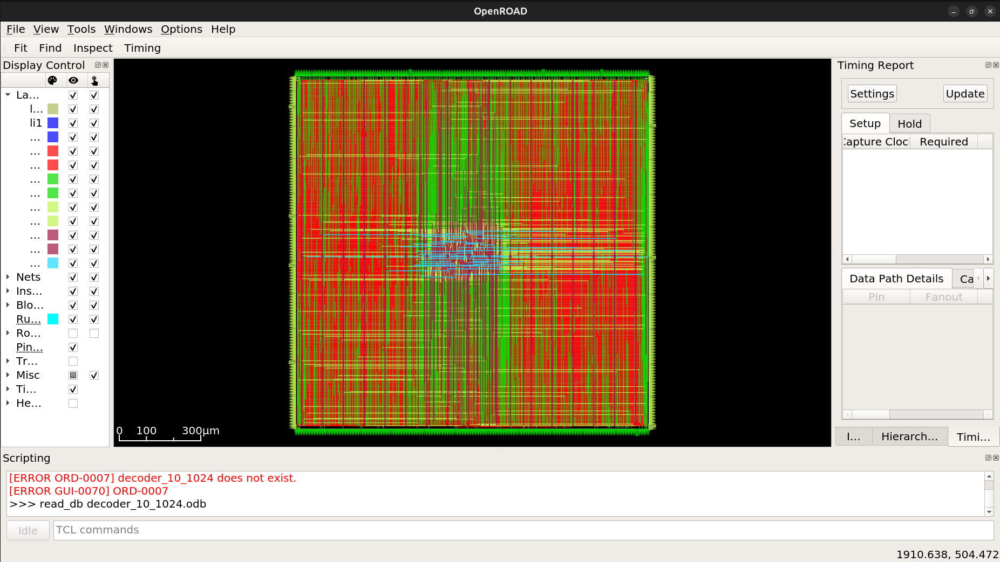
  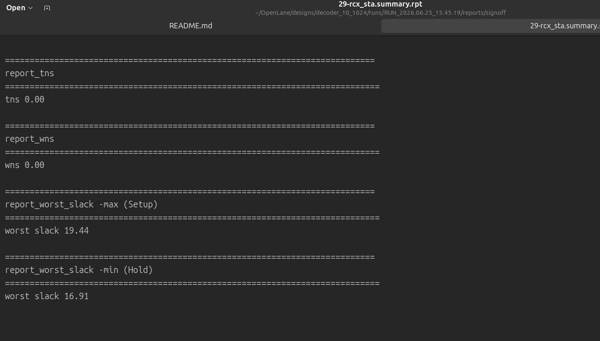
</p>

### 6️⃣ Final Signoff & Tapeout Views
The final step. The design underwent strict geometric and electrical verification (DRC, LVS, and Antenna checks) inside Magic. Below is the final `decoder_10_1024.gds` ready for the foundry!

<p align="center">
  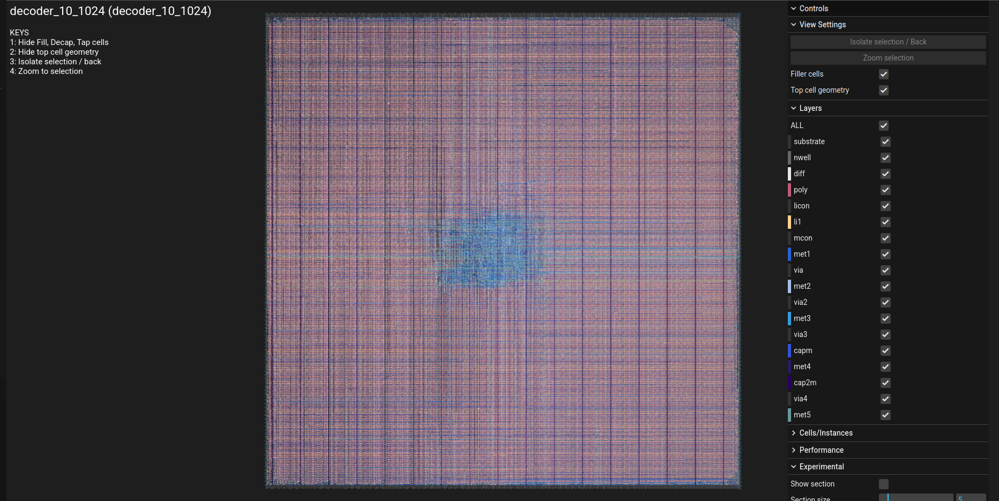
  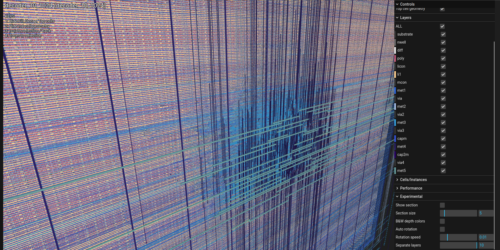
</p>

---

## 📂 Repository Structure

```text
├── decoder_ss/          # Visuals, screenshots, and reports for documentation
├── src/                 # Verilog source codes and testbenches
├── README.md            # You are here!
├── config.json          # OpenLane physical design configuration parameters
└── decoder_10_1024.zip  # Compressed package of the final GDS release
```

## 🚀 How to Reproduce

Want to build this chip on your own machine? 

**Prerequisites:**
* Linux OS (Ubuntu recommended)
* [OpenLane](https://github.com/The-OpenROAD-Project/OpenLane) installed via Docker
* Sky130 PDK configured

### Step 1: RTL Simulation
Test the logic before synthesizing:

```bash
# Compile the hierarchical design and testbench
iverilog -o tb_encoder src/encoder_1024_10.v src/tb_encoder_1024_10.v
```
# Execute the simulation
```
vvp tb_encoder
```
# View Waveforms
```
gtkwave tb_encoder.vcd
```

### Step 2: Physical Design Flow (RTL-to-GDSII)

Move this project directory into your OpenLane designs/ folder.
Bash
```
# 1. Mount the OpenLane Docker environment
make mount

# 2. Run the automated physical design pipeline
./flow.tcl -design encoder_1024_10
```

# 🤝 Acknowledgments

A huge thank you to the open-source silicon community, the OpenROAD project, and Google/SkyWater for democratizing hardware design and making these powerful tools and PDKs freely available.
